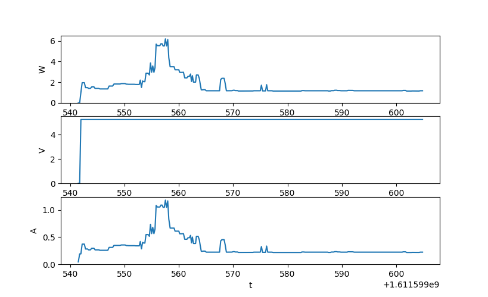
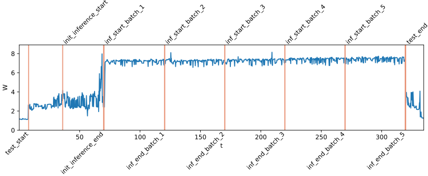

# DeepEdgeBench Testing Framework and summary

Python framework for testing Tensorflow imagenet image classification models trained on the [ImageNet dataset](http://image-net.org/) and object detection models trained on the [COCO dataset](https://cocodataset.org/#home) on various platforms including:
 - RKNN-Toolkit
 - Tensorflow
 - Tensorflow Lite (with TPU support)
 - TensorRT for ONNX models

Models can be found on the [Tensorflow 2 Detection Zoo](https://github.com/tensorflow/models/blob/master/research/object_detection/g3doc/tf2_detection_zoo.md) or [Tensorflow Model Garden](https://github.com/tensorflow/models)

To port a model to one of the mentioned platforms, following conversions are possible:
 - tensorflow 1 frozen graph -> rknn
 - tflite -> rknn
 - tensorflow frozen graph -> tensorflow 1 hub format
 - tensorflow saved model -> tflite (further steps needed, described later)
 - tensorflow saved model -> tensorflow saved model with tensorrt optimizations

It supports measuring the following parameters:
 - Inferencing time
 - Top-1 and Top-5 accuracy
 - mAP and Recall (evaluation via the COCO dataset)
 - Power consumption (optional, with the HM320P laboratory power supply)


## Dependencies
Power Consumption (serial_reader.py):
 - pymodbus
 - serial
 - numpy (optional for plotting)
 - matplotlib (optional for plotting)

Converting (convert.py):
 - numpy
 - rknn-toolkit (for RKNN Toolkit)
 - tensorflow 1.11 (for RKNN Toolkit)
 - tensorflow (for TensorRT and Tensorflow Lite)

Testing (test.py):
 - pycocotools
 - numpy
 - Pillow
 - rknn-toolkit (for RKNN Toolkit)
 - tensorrt (for TensorRT with ONNX)
 - tensorflow 1.11 (for RKNN Toolkit)
 - tensorflow (for Tensorflow)
 - tensorflow_hub (for Tensorflow 1 hub models)
 - tflite_runtime (for Tensorflow Lite)


## Examples
Examples are based on a configuration with tflite_runtime, rknn-toolkit and tensorflow 1.11 and tensorflow version 2.4 and tensorflow_hub.
### convert.py
#### Tensorflow 1 saved model to RKNN
RKNN-Toolkit only supports frozen graphs. Input size as well as input and output node names must be provided as arguments
```
$ python3.6 convert.py tf_rknn -d 128 -in FeatureExtractor/MobilenetV2/MobilenetV2/input -on concat,concat_1 models/mobilenet_v1/model.pb
...
```

#### Tensorflow Lite to RKNN
```
$ python3.6 convert.py tflite_rknn -d 128 models/mobilenet_v1/model.tflite
...
```

#### Tensorflow 2 saved model to Tensorflow Lite
Before converting models from the detection zoo to Tensorflow Lite, we have to follow step 1 from [this guide](https://github.com/tensorflow/models/blob/master/research/object_detection/g3doc/running_on_mobile_tf2.md).

```
$ python convert.py tf_tflite models/ssd_mobilenet_v2_320x320_coco17_tpu-8_lite/saved_model
...
```
With quantization:
```
$ python convert.py tf_tflite -q datasets/stuff_train2017.json -d 320 models/ssd_mobilenet_v2_320x320_coco17_tpu-8_lite/saved_model
...
```
Use [this guide](https://coral.ai/docs/edgetpu/compiler/#system-requirements) Tensorflow Lite model to use operations on Edge TPU or [this guide](https://github.com/tomassams/docker-edgetpu-compiler) for a docker based converter.

#### Tensorflow 1 frozen graph to Tensorflow Lite (not included)
```
 $ tflite_convert --graph_def_file=model.pb \
--output_file=model.tflite \
--output_format=TFLITE \
--input_arrays=image_tensor \
--input_shapes=1,300,300,3 \
--inference_type=FLOAT \
--output_arrays="detection_boxes,detection_classes,detection_scores,num_detections" \
--allow_custom_ops \
--enable_v1_converter
```

#### Tensorflow 1 hub & saved model optimization with TF-TRT
Optimizing a Tensorflow 1 hub and saved model with TensorRT:
```
$ python convert.py tf_tensorrt -d 320 -p int8 models/mobilenet_v1/saved_model
...
```
Input dimensions (-d) must be specified in order to build the TRT engines, precision mode (-p) defaults to fp32.

#### Tensorflow 1 & 2 saved model to ONNX (not included)
To run a model on the TensorRT engine, the model must be converted to ONNX format. With [tf2onnx](https://github.com/onnx/tensorflow-onnx) tool:
```
$ python -m tf2onnx.convert --saved-model models/mobilenet_v1/saved_model --output model.onnx --opset 11 --inputs MobilenetV1/Predictions/Reshape_1:0[1,128,128,3]
...
```

### test.py
Inference 10 images using the same model in different formats:
```
$ python test.py tensorflow models/ssd_mobilenet_v2_320x320_coco17_tpu-8/saved_model datasets/instances_val2017.json -n 10 # Tensorflow
...
$ python3.6 test.py tflite models/ssd_mobilenet_v2_320x320_coco17_tpu-8/model.tflite datasets/instances_val2017.json -n 10 -t fp32 -d 300 # Tensorflow Lite
...
$ python3.6 test.py tflite models/ssd_mobilenet_v2_320x320_coco17_tpu-8/model.tflite datasets/instances_val2017.json -n 10 -t fp32 -d 300 -u # Tensorflow Lite with TPU
...
$ python3.6 test.py onnx_trt models/ssd_mobilenet_v2_320x320_coco17_tpu-8/model.onnx datasets/instances_val2017.json -n 10 -t fp32 -d 300 # ONNX on TensorRT
...
```
For models with input type other than int8, the value must be set with the -t or --input_type flag.
Also -d or --input\_dims must be provided when the input is fixed to a specific size.


Compatibility with Tensorflow 1 saved models:
```
$ python test.py tensorflow_1 models/mobilenet_v1/saved_model datasets/instances_val2017.json -f data_inf.txt -n 1
...
```
For models with tags != 'serving' or signature != 'serving_default', these can be adjusted with -it and --is


Inference one image 10 times and save timestamps to file (repetition may be useful for accuracy when estimating power consumption):
```
$ python test.py tensorflow models/ssd_mobilenet_v2_320x320_coco17_tpu-8/saved_model -f data_inf.txt -n 1 -r 10
...
$ cat data_inf.txt
label_data
1611581708.129394 test_start
1611581709.112203 init_inference_start
1611581709.163041 init_inference_end
1611581709.844171 inf_start_batch_1
1611581709.878387 inf_end_batch_1
1611581710.254445 inf_start_batch_2
...
```

Inference 10 images and save annotated output to './images/' (with output example):
```
$ python3.6 test.py tflite models/ssd_mobilenet_v2_fpnlite_320x320_coco17_tpu-8_lite/model.tflite datasets/instances_val2017.json -n 10 -o -t fp32 -d 320
loading annotations into memory...
Done (t=0.39s)
creating index...
index created!
First inference took 1.979932 seconds
Inference took 1.964706 seconds
Inference took 1.965933 seconds
Inference took 1.975681 seconds
Inference took 1.974938 seconds
Inference took 1.971175 seconds
Inference took 1.964809 seconds
Inference took 1.981329 seconds
Inference took 1.962942 seconds
Inference took 1.961184 seconds
Inference took 1.978157 seconds
Inferenced 10 images in 19.700853 seconds
Loading and preparing results...
DONE (t=0.00s)
creating index...
index created!
Running per image evaluation...
Evaluate annotation type *bbox*
DONE (t=0.03s).
Accumulating evaluation results...
DONE (t=0.07s).
 Average Precision  (AP) @[ IoU=0.50:0.95 | area=   all | maxDets=100 ] = 0.138
 Average Precision  (AP) @[ IoU=0.50      | area=   all | maxDets=100 ] = 0.232
 Average Precision  (AP) @[ IoU=0.75      | area=   all | maxDets=100 ] = 0.182
 Average Precision  (AP) @[ IoU=0.50:0.95 | area= small | maxDets=100 ] = 0.006
 Average Precision  (AP) @[ IoU=0.50:0.95 | area=medium | maxDets=100 ] = 0.335
 Average Precision  (AP) @[ IoU=0.50:0.95 | area= large | maxDets=100 ] = 0.352
 Average Recall     (AR) @[ IoU=0.50:0.95 | area=   all | maxDets=  1 ] = 0.117
 Average Recall     (AR) @[ IoU=0.50:0.95 | area=   all | maxDets= 10 ] = 0.156
 Average Recall     (AR) @[ IoU=0.50:0.95 | area=   all | maxDets=100 ] = 0.156
 Average Recall     (AR) @[ IoU=0.50:0.95 | area= small | maxDets=100 ] = 0.009
 Average Recall     (AR) @[ IoU=0.50:0.95 | area=medium | maxDets=100 ] = 0.383
 Average Recall     (AR) @[ IoU=0.50:0.95 | area= large | maxDets=100 ] = 0.395
$
```

### serial\_reader.py
The python library for the HM310P is also separately available [here](https://github.com/stephanballer/pyhm310p)

Show live plot and save data with timestamps to file:
```
$ python serial_reader.py monitor /dev/ttyUSB0 -l -f data_pow.txt
```


Plot power measurement and inference data:
```
$ python serial_reader.py plot data_pow.txt data_inf.txt
```

